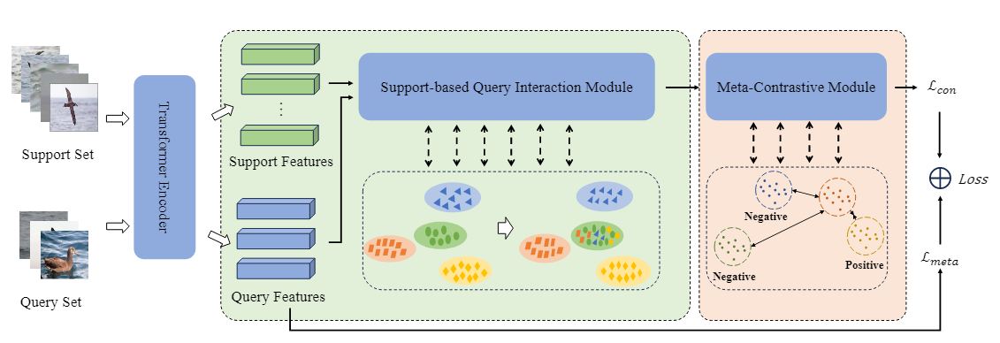
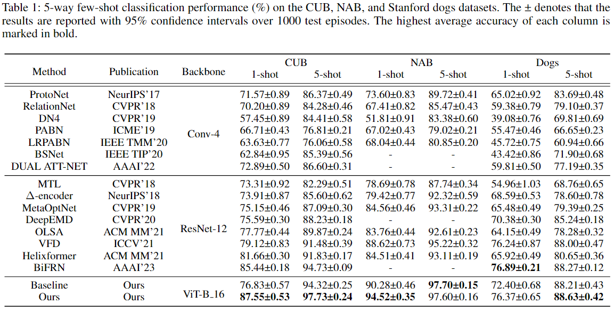

# Meta-contrastive Learning with Support-based Query Interaction for Few-shot Fine-grained Visual Classification

Few-shot fine-grained visual classification combines the challenge of scarcity of training data for few-shot tasks and intrinsic property with inter-intra variance for fine-grained tasks. To alleviate this problem, we first propose a support-based query interaction module and a meta-contrastive method. Extensive experiments demonstrate that our method performs well on both common fine-grained datasets and few-shot datasets in different experimental settings.

# Architecture of our proposed Network

#  Result

